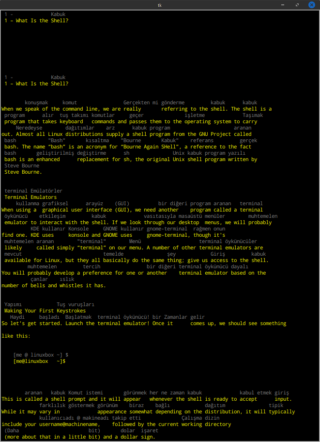

# pdfviewer
pdf viewer that translates unknown words.

### USAGE
First you must enter the words you know into "sözcükler". You can add by running sözcükAl.py and selecting the word you knows.
> python sözcükAl.py

Pdfviewer looks at this file and detect and sends the unknown words to google transtlate and writes the result above the word.
> python pdfGösterici.py "name of pdf file"

### Current Settings
The current translation is adjusted from English to Turkish. 

background color is black  
original text color is yellow  
the color of the translated text is gray  

### Required Libraries

poppler 
mtranslate 
pyperclip = for ctrl + c 
